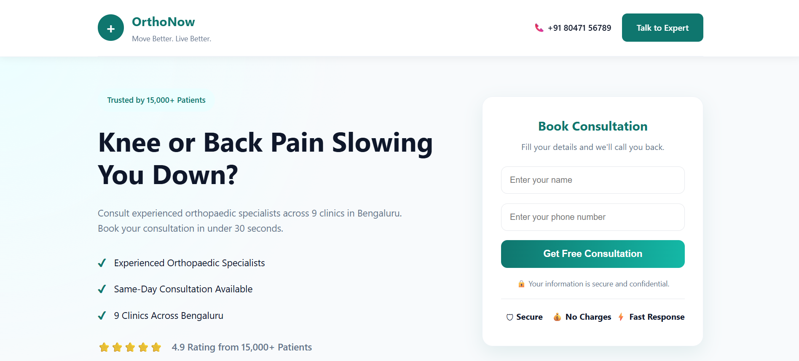

# Namoza Developer Assignment

## Candidate Details

**Name:** Manas Tripathi

**Role Applied For:** Developer – Position 1 (Client Web + Martech)

---

# Assignment Overview

This repository contains my submission for the Namoza Developer Assignment. The assignment focuses on solving real-world marketing technology (MarTech) challenges for a healthcare client, **OrthoNow**, by designing analytics tracking, developing a high-converting landing page, and proposing a scalable CRM integration architecture.
---

## Repository Structure

```
OrthoNow-Assignment/
│
├── Task-1/
│   ├── Booking_Funnel_Tracking.md
│   ├── GTM_Event_Schema.md
│
├── Task-2/
│   ├── index.html
│   ├── style.css
│   ├── script.js
│   ├── assets/
│   └── screenshots/
│       ├── desktop-pagespeed.png
│       ├── mobile-pagespeed.png
│       ├── desktop-landing-page.png
│       └── mobile-landing-page.png
│
├── Task-3/
│   └── README.md
│
└── README.md
```

---

# [Live Demo Link -](https://namoza-developer-assignment-rho.vercel.app/) 


# Tasks Included

## Task 1 – GTM Event Tracking Strategy

- Complete Google Tag Manager Event Schema
- GA4 Event Mapping
- Booking Funnel Tracking
- dataLayer Implementation
- Google Ads Conversion Strategy

---

## Task 2 – Landing Page Development

- Single-file HTML Landing Page
- Mobile-First Responsive Design
- Conversion-Focused Layout
- GTM dataLayer Integration
- Core Web Vitals Optimized

---

## Task 3 – CRM Integration Design

- HubSpot CRM Integration Architecture
- WhatsApp Business API Workflow
- Google Ads Conversion Flow
- Failure Handling & Monitoring Strategy

---

# Technologies Used

- HTML5
- CSS3
- Vanilla JavaScript
- Google Tag Manager (Design)

---
## Design Decisions

- Used a clean healthcare color palette (Teal & White) to create trust.
- Kept navigation minimal to reduce distractions.
- Positioned the consultation form in the Hero section for better conversions.
- Used responsive design to support desktop and mobile devices.
- Added GTM custom event tracking for form submissions.

## Known Limitations

- Form data is not stored in a backend database.
- GTM events can be viewed only after publishing the GTM container.
- Patient reviews are static demo content.
## Preview


# Notes

This submission has been structured as if it were an internal client project within a digital growth agency. The documentation, code organization, and implementation decisions have been prepared with maintainability, scalability, and business outcomes in mind.

## Performance Testing

The landing page was tested after deployment using Google PageSpeed Insights.

### Desktop Results

- Performance: 100
- First Contentful Paint: 0.2 s
- Largest Contentful Paint: 0.2 s
- Total Blocking Time: 0 ms
- Speed Index: 0.7 s
- Cumulative Layout Shift: 0

### Optimizations Applied

- Responsive layout using CSS Grid and Flexbox
- Lightweight SVG icons instead of heavy image assets
- No external UI libraries or frameworks
- Minimal JavaScript for faster execution
- Optimized CSS with reusable variables
- Sticky header with efficient rendering
- Hosted on Vercel CDN for fast global delivery
---

Thank you for reviewing my submission.